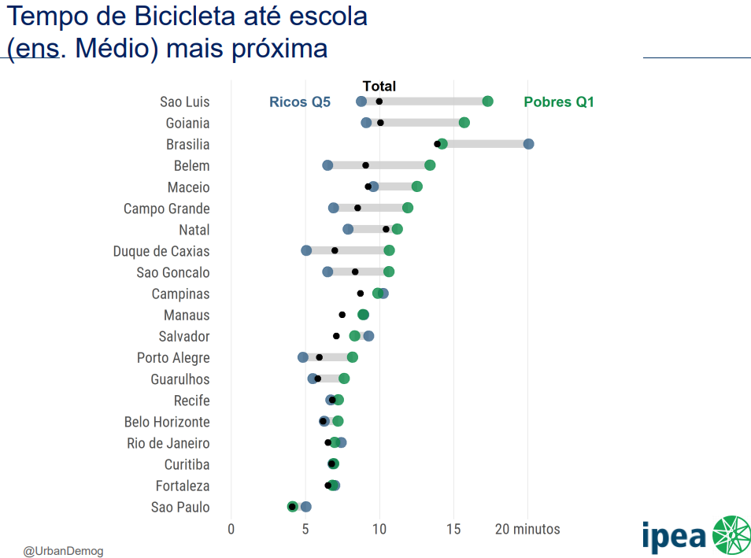

```{r child = "setup.Rmd"}
```

```{r xaringan-tile-view, echo=FALSE}
xaringanExtra::use_tile_view()
```

```{r xaringan-editable, echo=FALSE}
xaringanExtra::use_editable(expires = 1)
```

```{r xaringan-panelset, echo=FALSE, message=FALSE, warning=FALSE}
xaringanExtra::use_panelset()
xaringanExtra::style_panelset_tabs(panel_tab_font_family = "sans-serif")
```

```{r xaringanExtra-clipboard, echo=FALSE}
htmltools::tagList(
  xaringanExtra::use_clipboard(
    button_text = "<i class=\"fa fa-clipboard\"></i>",
    success_text = "<i class=\"fa fa-check\" style=\"color: #90BE6D\"></i>",
    error_text = "<i class=\"fa fa-times-circle\" style=\"color: #F94144\"></i>"
  ),
  rmarkdown::html_dependency_font_awesome()
)
```

```{r xaringan-fit-screen, echo=FALSE}
xaringanExtra::use_fit_screen()
```

```{r xaringan-extra-styles, echo=FALSE}
xaringanExtra::use_extra_styles(
  hover_code_line = TRUE,         #<<
  mute_unhighlighted_code = TRUE  #<<
)
```

```{r xaringan-scribble, echo=FALSE}
xaringanExtra::use_scribble()
```


# Cidades x Espaço urbano


+ Gênese das cidades   
+ Em 1800, apenas quatro por cento da população mundial vivia em cidades. 
+ Em 2000, esse número havia crescido para 50%. Hoje, há mais pessoas morando em cidades maiores (KAPLAN et al., 2004).
+ 54 % da população mundial vive em áreas urbanas (UN, 2014)
+ 2050 – 66% de população urbana


---


# Primeira lei da Geografia

---

# Primeira lei da Geografia 

.question[
.large[
Todas as coisas estão relacionadas com todas as outras, mas coisas próximas estão mais relacionadas do que coisas distantes (Waldo Tobler)
]
]

## AUTOCORRELAÇÃO ESPACIAL


```{r echo=FALSE, message=FALSE, warning=FALSE, fig.align='center', out.width="25%"}

```

---

# Teoria dos lugares centrais

.panelset[

.panel[.panel-name[Fundamentos]

- O consumidor **acessa** o lugar central de maior **hierarquia** mais **próximo**
- Conceito de distância
- **Centralidade** - capacidade de atrair áreas vizinhas
- **Hierarquia** - rede urbana
- Equilíbrio entre **limiar** (consumidor/demanda) e **alcance** (produto ou serviço)
- **Funções urbanas de baixa e alta ordem** - exemplos

]

.panel[.panel-name[Modelo]

```{r echo=FALSE, message=FALSE, warning=FALSE, fig.align='center', out.width="35%"}

```

]

]

---

# Mobilidade e Acessibilidade urbana

.center[.larger[
**Quais princípios devem ser considerados no planejamento do espaço urbano???**
]]


---

# Mobilidade e Acessibilidade urbana

```{r echo=FALSE, message=FALSE, warning=FALSE, fig.align='center', out.width="50%"}
knitr::include_graphics("./img/5.jpg")
```


---

# Mobilidade e Acessibilidade urbana

### Mobilidade urbana
.pull-left[
**Política Nacional de Mobilidade Urbana (Lei nº 12.587/2012)**

“o conjunto de **deslocamentos** de pessoas e bens no espaço urbano, englobando os modos motorizados e não motorizados, os serviços de transporte público e privado, os terminais e pontos de conexão, as infraestruturas viárias e de trânsito, os sistemas de sinalização, os equipamentos e serviços de apoio”
]

.pull-right[

```{r echo=FALSE, message=FALSE, warning=FALSE, fig.align='center', out.width="90%"}

```
]

---

# Mobilidade e Acessibilidade urbana


.center[.larger[
**Quanto tempo você leva para chegar até o hospital ou escola mais próxima da sua casa? Quantos postos de trabalho você consegue acessar em menos de uma hora?**]]


---

# Mobilidade e Acessibilidade urbana

### Acessibilidade urbana

"é **facilidade de se chegar até oportunidades** de emprego, serviços de saúde e educação, atividades culturais, áreas verdes, etc. O nível de acessibilidade de uma cidade ou bairro depende da **eficiência e conectividade da rede de transporte**, mas também da **proximidade entre pessoas e atividades**. A promoção de cidades mais sustentáveis, inclusivas e inteligentes exige políticas que melhorem a acessibilidade urbana e reduzam as desigualdades de acesso a oportunidades." ([Projeto acesso a oportunidades - IPEA](https://www.ipea.gov.br/acessooportunidades/))


---


```{r echo=FALSE, message=FALSE, warning=FALSE, fig.align='center', out.width="80%"}

```

---

```{r echo=FALSE, message=FALSE, warning=FALSE, fig.align='center', out.width="90%"}

```

---


```{r echo=FALSE, message=FALSE, warning=FALSE, fig.align='center', out.width="75%"}

```

---


```{r echo=FALSE, message=FALSE, warning=FALSE, fig.align='center', out.width="60%"}

```

---


```{r echo=FALSE, message=FALSE, warning=FALSE, fig.align='center', out.width="90%"}

```


---


```{r echo=FALSE, message=FALSE, warning=FALSE, fig.align='center', out.width="70%"}

```
---


```{r echo=FALSE, message=FALSE, warning=FALSE, fig.align='center', out.width="65%"}

```
---


```{r echo=FALSE, message=FALSE, warning=FALSE, fig.align='center', out.width="80%"}
knitr::include_graphics("./img/14.png")
```


---
# Para pensar

- Gentrificação
- Espraiamento urbano
- Aumento da qualidade e da abrangência dos transportes
- Verticalização e adensamento

